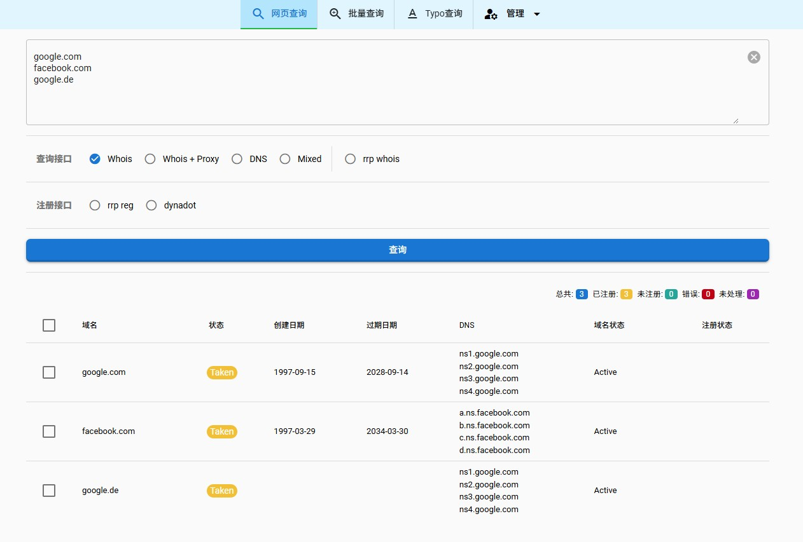
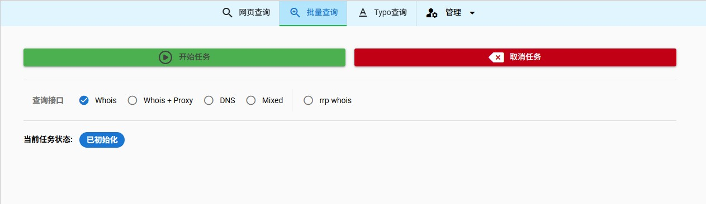
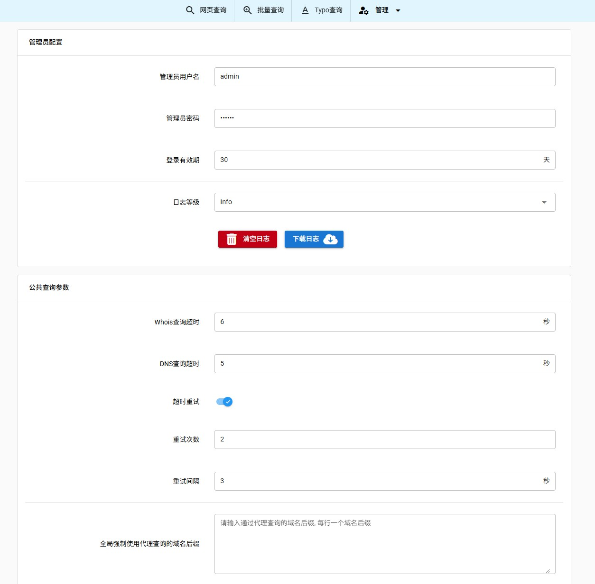
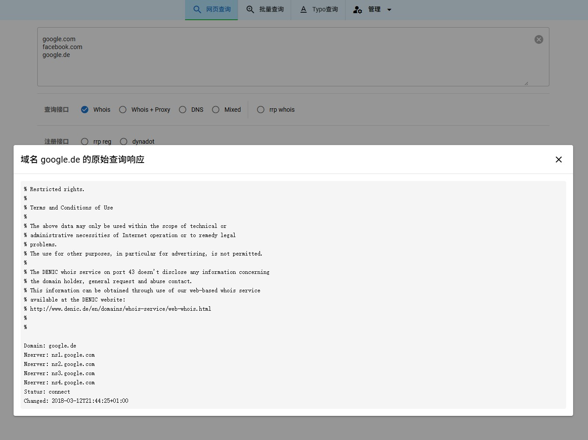

English | [中文](./README.zh.md)

# PowerWhois

## Web Version: [link](https://whois.1ka.net)

## screenshot







## Features
1. In addition to web queries, supports batch domain name queries. Tested with uploading 1 million domain names without issues, and the speed is extremely fast.
2. Clicking on the web query results will pop up the original WHOIS information.
3. Supports all suffixes. Some can only use DNS mode, so a small number of domains reserved by registrars may be inaccurate, but should be very few.
4. Supports proxy settings and allows setting proxies for different suffixes.
5. Added Mix mode, which allows freely setting direct connection, proxy, or DNS scanning for different suffixes.
6. Supports typo generation.
7. Supports custom WHOIS APIs, allowing you to add your commonly used registrar APIs to check domain availability.
8. Supports domain registration and custom register APIs, allowing you to add your commonly used registrar APIs for convenient domain registration.
9. Backend settings can control threads, failed retries, and various other settings.
10. Supports API mode. You can use the program as an API, for example, integrate it with your WHMCS. [See documentation](https://github.com/WenLiCG/PowerWhois/blob/main/API%20documentation.md)

## Directory Structure

```
.
├── deploy  (Deployment related)
│   ├── backend (Backend program)
│   ├── docker-compose.yml
│   ├── frontend    (Frontend program)
│   ├── nginx       (Nginx configuration files)
│   └── redis       (Redis related)
├── README.md   (Documentation)
└── src (Source code directory)
    ├── backend     (Backend source code)
    ├── frontend    (Frontend source code)
    └── Makefile
```

# Deployment

## Server Dependencies

- Docker

## Upload Files

Upload the contents of the `deploy` folder to the server as is.

## Configuration

- Modify the `server_name` in the Nginx configuration file `deploy/nginx/typonamer.conf` for ports 443 and 80 to your actual target domain name.
  
- Update the `ssl_certificate` and `ssl_certificate_key` paths in the Nginx configuration file `deploy/nginx/typonamer.conf` for port 443 to the actual paths of your SSL certificate and key.
  
- Change the `root` path in the Nginx configuration file `deploy/nginx/typonamer.conf` for port 443 to the actual absolute path of the `deploy/frontend` folder on your host.
  
- Copy the Nginx configuration file `deploy/nginx/typonamer.conf` to the Nginx configuration directory on the host, typically `/etc/nginx/conf.d/`.
  
- Modify the `AuthUsername` and `AuthPassword` in the `deploy/backend/config.yaml` file. `AuthUsername` is the administrator's username, and `AuthPassword` is the administrator's password.

## Deployment Steps

- Navigate to the `deploy` directory on the server.
- Execute the command: `docker compose up -d`
- Restart Nginx on the host: `sudo systemctl restart nginx`
- Visit the website, for example: `https://typonamer.example.com`

# Development

## Backend

The backend is developed using the Golang language, with the Gofiber web framework.

### Dependencies

- Golang 1.23+

## Frontend

The frontend is developed using Vue3, with the Quasar 2 UI framework.

### Dependencies

- Node.js v20+
- yarn 1.22+

### Initialization

```
cd src/frontend
yarn
quasar dev
```

## Compilation

A `src/Makefile` file is provided in the project source directory. After installing backend dependencies, frontend dependencies, and the `make` command on Linux, you can start compiling. The compiled output will automatically replace the contents of `deploy/backend` and `deploy/frontend`. You need to manually upload the newly compiled files to the server to replace the old server files, then restart the containers for the changes to take effect.

### Compile Backend Code Only

```
cd src/
make backend
```

### Compile Frontend Code Only

```
cd src/
make frontend
```

### Compile Both Frontend and Backend Code

```
cd src/
make all
```

## Contributing

Contributions are welcome! Please feel free to submit a Pull Request.
